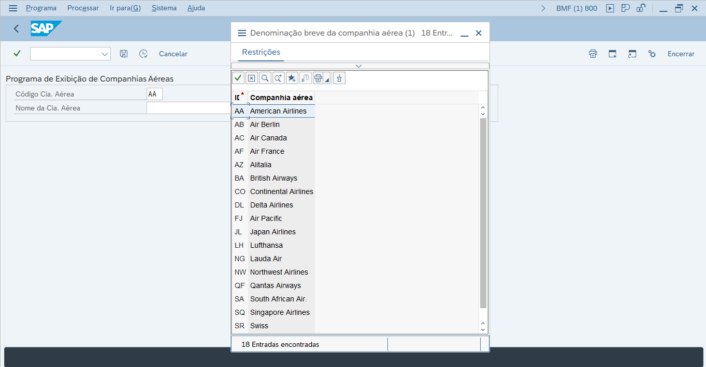

# 📊 Report ABAP - Exibição de Companhias Aéreas (Tabela SCARR)  
# 📊 ABAP Report – Airline Display (SCARR Table)

---

## Português

Este projeto ABAP tem como objetivo exibir dados de companhias aéreas utilizando a **tabela padrão SCARR** do SAP. A tabela SCARR contém informações sobre as companhias, como seu **ID**, **nome** e **moeda utilizada**.

### 🔎 Funcionalidade

O programa permite que o usuário filtre os dados informando:  
- O **ID da Companhia Aérea** (`CARRID`), e/ou  
- O **Nome da Companhia Aérea** (`CARRNAME`)

O sistema então realiza uma consulta na tabela **SCARR** e exibe os seguintes campos:  
- **Mandante** (`MANDT`)  
- **ID da Companhia Aérea** (`CARRID`)  
- **Nome da Companhia Aérea** (`CARRNAME`)  
- **Código da Moeda** (`CURRCODE`)

### 🖼️ Telas do Sistema

#### 📌 Tela de Seleção dos Parâmetros

#### 📋 Resultado da Execução

### 📂 Arquivo

- `ZESTUDOABAP_AEREO.abap` — Código‑fonte do report ABAP.

### 📌 Tabela Utilizada

- `SCARR` — Tabela padrão do SAP que armazena informações sobre companhias aéreas.

### 🚀 Como usar

1. Crie um novo report no SE38 ou SE80 com o conteúdo do arquivo `.abap`.  
2. Execute o programa no SAP GUI.  
3. Informe um ID ou nome de companhia aérea.  
4. Veja o resultado com os dados detalhados da tabela SCARR.

---

Feito com 💙 em ABAP — por um entusiasta SAP.

---

## English

This ABAP project aims to display airline data using the **standard SCARR table** in SAP. The SCARR table contains information about airlines, such as their **ID**, **name**, and **currency**.

### 🔎 Functionality

The program allows the user to filter the data by providing:  
- The **Airline ID** (`CARRID`), and/or  
- The **Airline Name** (`CARRNAME`)

The system then performs a select on the **SCARR** table and displays the following fields:  
- **Client** (`MANDT`)  
- **Airline ID** (`CARRID`)  
- **Airline Name** (`CARRNAME`)  
- **Currency Code** (`CURRCODE`)

### 🖼️ Screenshots

#### 📌 Selection Screen

#### 📋 Execution Result

### 📂 File

- `ZESTUDOABAP_AEREO.abap` — ABAP report source code.

### 📌 Table Used

- `SCARR` — Standard SAP table storing airline information.

### 🚀 How to Use

1. Create a new report in SE38 or SE80 with the content of the `.abap` file.  
2. Run the program in the SAP GUI.  
3. Enter an airline ID or name.  
4. View the detailed SCARR table data output.

---

Made with 💙 in ABAP — by an SAP enthusiast.  
